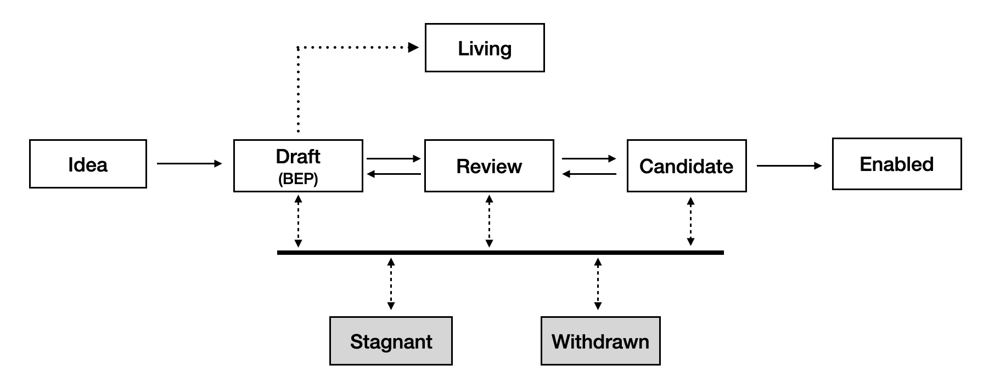

# BEP 1: Purpose and Guidelines

- [BEP 1: Purpose and Guidelines](#bep-1-purpose-and-guidelines)
  - [1.  What is BEP?](#1--what-is-bep)
  - [2.  BEP Rationale](#2--bep-rationale)
  - [3.  BEP Types](#3--bep-types)
  - [4.  BEP Workflow](#4--bep-workflow)
  - [5.  Reference](#5--reference)
  - [6.  License](#6--license)

## 1.  What is BEP?

BEP stands for BNB Chain Evolution Proposal. Each BEP will be a proposal document providing information to the BNB Chain community, both BNB Beacon Chain and BNB Smart Chain. The BEP should provide a concise technical specification of the feature or improvement and the rationale behind it. Each BEP proposer is responsible for building consensus within the community and documenting dissenting opinions. Each BEP has a unique index number.

## 2.  BEP Rationale

BEP is the primary mechanism for proposing new features, for collecting community technical input on issues, and for documenting the design decisions that go into BNB Chain. Because BEPs are maintained as text files in a versioned repository, their revisions are the historical records of feature proposals.

For BNB Chain contributors, it is a convenient way to track the progress of their implementation by BEPs. It will help end users to know the status of a given feature, function or improvement.

##  3.  BEP Types

There are three types of BEP:

- **Standards**: A Standards BEP describes functional changes on BNB Chain, such as a change to the network protocol, proposer selection mechanism in consensus algorithm, change in block size or fee mechanism in application level. It will effect the implementation of BNB Chain.
- **Information**: An Information BEP will clarify some concepts of the BNB Chain, it may not effect the BNB Chain client implementation.
- **Process**: This kind of proposal will change the workflow of BNB Chain working process, like this BEP itself.

## 4.  BEP Workflow

*Figure 1: BEP workflow*

Once the idea is accepted, each status change is requested by the BEP author and reviewed by the BEP editors. Use a pull request to update the status.

- **Idea**: If you have an idea but not sure if it worths a BEP or not, you may discuss with the community first before you put too much effort. You may post your idea in [bnb chain forum](https://forum.bnbchain.org/) and visit the [bep-discussion channel in our discord](https://discord.gg/bnbchain) to let the community know it.
- **Pre-Draft**: If your idea is accepted, it is still not a BEP yet. A formal document will be needed to describe your idea, the Pre-Draft document should follow the BEP format. And you need to create a pull request and the BEP editors will review it.
- **Draft**: Once the Pre-Draft pull request is accepted by the community and reviewed by the BEP editors, it can be merged. The pull request number will be used as the BEP number, which means it is a legal BEP now. The BEP editors will add the status, then it will be recorded and maintained by the community. The BEP author should keep pushing it forward, the author can update the BEP by creating new pull requests.
- **Final**: This proposal is finalized and a reference implementation should be provided.
- **Enabled**: This proposal is enabled in BNB Chain mainnet, if it is a hard fork, the fork number has reached.

Other exceptional statuses include:

- **Living**: A BEP will be long-term maintained, like this BEP.
- **Stagnant**: A BEP has not been updated for more than 6 months, it will enter Stagnant state.
- **Withdrawn**: A BEP that is dropped and will not be implemented. Usually, it is due to some prerequisite conditions that are not true anymore.

## 5.  Reference

Ethereum Improvement Proposals:  [https://github.com/ethereum/EIPs](https://github.com/ethereum/EIPs/blob/master/EIPS/eip-1.md)

Bitcoin Improvement Proposals:  <https://github.com/bitcoin/bips>

##  6.  License

All the content are licensed under [CC0](https://creativecommons.org/publicdomain/zero/1.0/).
